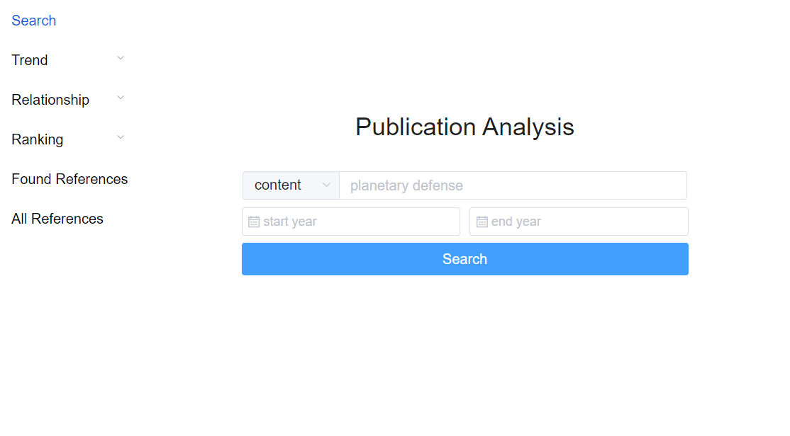

# Publication Analysis Module

This repository stores publication analysis module under stccenter knowledge base framework, you can check the example in Planetary Defense Gateway:
https://pd.stcenter.net/index.php/pdc-datavisualization/

## Deploy front end

Install node.js https://nodejs.org/en/download/

Check node version and npm command

`$ node -v`

`$ npm -v`

Change working directory to front_end. Then run below comment in terminal.

`$ npm install`

Note: In case if you get any security alert, run 
'$npm audit fix'

Then

`$npm run dev`

It should pack up a dist folder in the root directory

## Deploy back end
Change working directory to back_end. Then run below comments in terminal.

Use python 3 or higher version, install flask

`$ pip3 install flask`

Under back end directory, run

`$ python app.py`

It should start a back end port

## Using database to connect back end
Open pgAdmin and connect to your database.
Create a table using query: 

The data of project should be store to your own database, different database have their own python connection library. Here we use the example of postgresql. 

Add your database information in the db connection part

`conn = psycopg2.connect(database='', host='', user='', password='', port='')`

Restart back end service

## Data description 
check sample.csv file in the directory

| Field Name | Description                                                  | Format     | Example |
| -------------- | ------------------------------------------------------------ | ---------- | ------- |
| id | ID of publication, not NULL                                              | int | 1 |
| pub_type  | Type of publication, "C" for conference, "J" for journal, "B" for book | varchar(2) | C |
| pub_name  | Name of the publicatoin                         | varchar | Asteroids, Comets, Meteors 2014 |
| peer_reviewed  | Whether the article is peer reviewed                 | boolean  | T |
| title | Title of article                  | text | Modelling IPPD for an Interdisciplinary Planetary Defense Project |
| doc_type | Type of original document                      | varchar(30) | Abstract |
| author | Authors' name from file, use "; " to seperate different value                          | text | Glaab, L; Peterson, T |
| author_full | Author's full name, use "; " to seperate different value                          | text | Louis Glaab; Todd Peterson |
| institute | Institution of authors, use "; " to seperate different value                          | text | NASA; MIT |
| nation | Nation of authors, use "; " to seperate different value                          | text | USA; France |
| keyword | Keywords of article, use "; " to seperate different value                          | text | asteroid; comet; deflection; nuclear |
| keyword_plus | Extra keywords, back up for certain academic databases                          | text | atmospheric entry; ablation; airburst |
| abstract | Abstract of article                          | text | "see example file" |
| cite_num | Times of being cited                          | int | 20 |
| month | Published month                          | int | 8 |
| year | Published date                          | int | 2020 |
| doi | Doi of article                          | text | 10.1016/j.actaastro.2007.03.011 |
| file_name | Name of origin file, usually for downloaded file                          | text | IAA-PDC-15-02-01ab.pdf |
| url | URL of article, usually add html header to doi                          | text | http://doi.org/10.1016/j.actaastro.2007.03.013 |
| research_area | Research area of article                         | text | 1 |
| reference_list | Reference of article (to cite the article)                          | text | Managan, R. A., Howley, K.M. and Wasem, J.V., 2015. 1D to 3D MAPPING FOR NUCLEAR ENERGY DEPOSITION. Planetary Defense Conference. 2015 |

## Start the service

If you want to deploy it to virtual machine to start a service, you can Nginx to do front, back end redirect. Install Nignx and set up config file, target root to dist folder, note that port 5000 should be targeted to back end.

